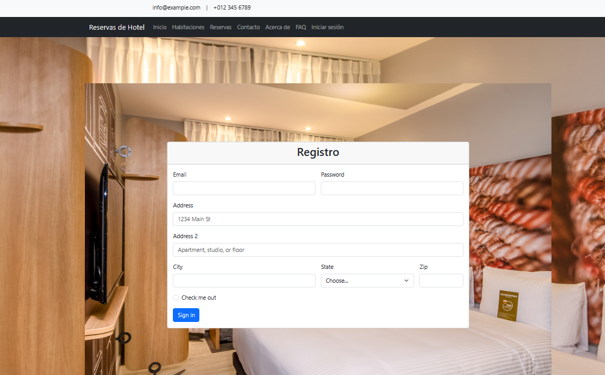
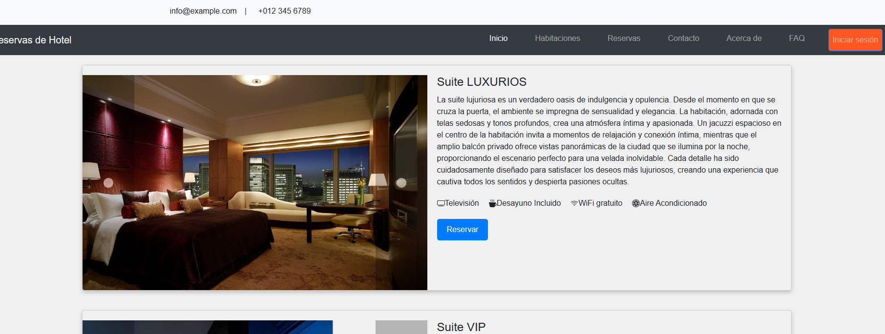
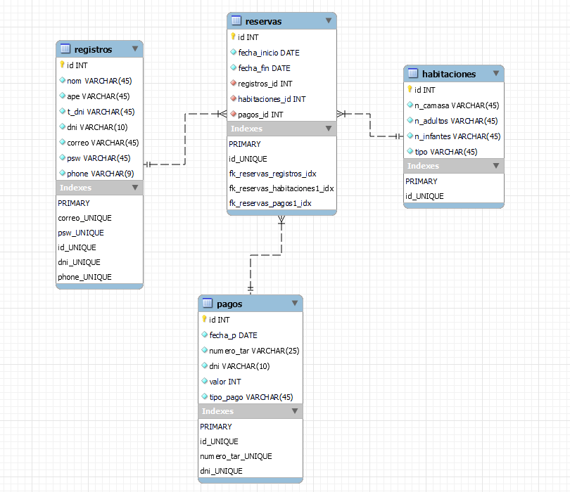

# Reservas de Habitaciones de Hotel

**HabitatReservas - Una Aplicación Web de Reservas de Habitaciones de Hotel**

## Descripción

HabitatReservas es una aplicación web diseñada para simplificar y agilizar el proceso de reserva de habitaciones de hotel. Esta aplicación ha sido desarrollada utilizando tecnologías web modernas, incluyendo Java, JSP, y MySQL, y se ejecuta en un entorno basado en el servidor Apache Tomcat.

## Capturas

## Características

Enumera las principales características de tu aplicación:

- Inicio de Sesión Seguro: HabitatReservas ofrece un sistema de inicio de sesión seguro que permite a los usuarios registrados acceder a sus cuentas utilizando sus credenciales personales. Se ha implementado una autenticación robusta para garantizar la seguridad de la información del usuario.
- Reserva de Habitaciones: Los usuarios pueden seleccionar entre una variedad de opciones de habitaciones de hotel, incluyendo habitaciones VIP, lujosas, familiares e individuales. Pueden especificar las fechas de entrada y salida, así como la cantidad de adultos, niños y camas necesarias.
- Múltiples Métodos de Pago: La aplicación admite múltiples métodos de pago, incluyendo tarjetas de crédito y PayPal. Los usuarios pueden ingresar los detalles de su método de pago preferido de forma segura.
- Previsualización de Reserva: Antes de confirmar la reserva, los usuarios tienen la opción de previsualizar su selección, lo que les permite revisar y verificar los detalles de su reserva antes de proceder al pago.
- Registro de Reservas: La aplicación registra las reservas realizadas, manteniendo un historial para cada usuario. Esto facilita la gestión y consulta de reservas anteriores.

## Tecnologías Utilizadas:

- Java 8
- JSP (JavaServer Pages)
- MySQL Database
- Apache Tomcat
- HTML5/CSS3
- Bootstrap para diseño responsivo
- NetBeans IDE para desarrollo

## Instalación

- Clona el repositorio desde GitHub.
- Importa el proyecto en NetBeans IDE.
- Configura la base de datos MySQL y ajusta la configuración de conexión en la aplicación.
- Implementa la aplicación en un servidor Apache Tomcat.
- Accede a la aplicación a través de un navegador web.

### Licencia

Este proyecto está bajo la Licencia MIT. Consulta el archivo [LICENSE](LICENSE)para obtener más detalles sobre los términos y condiciones de la licencia.

